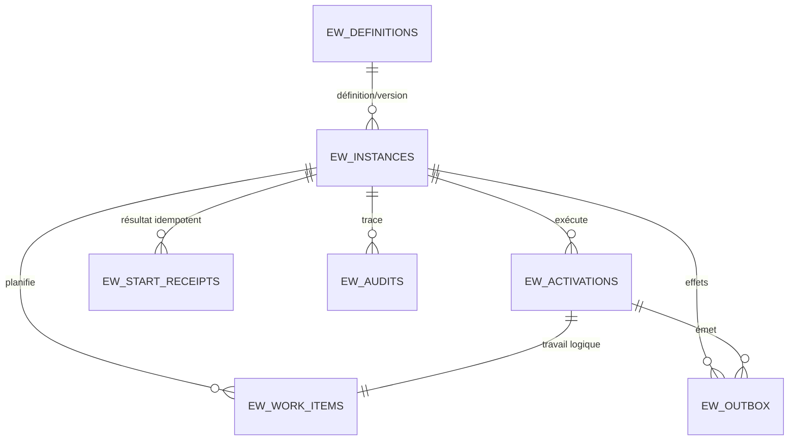

# Schéma physique Oracle du framework

Statut : schéma workflow L3b/L4b et schéma sécurité L5 séparé, qualifiés sur Oracle Database Enterprise 19.19. L’historique sécurité est `EW_SECURITY_MIGRATIONS`.

Les tables appartiennent au schéma Oracle configuré dans la chaîne de connexion. Elles ne sont pas une API SQL publique : les mutations passent par `IWorkflowStore`, afin de préserver transactions, révisions, idempotence et fencing.

## Relations

## Tables fonctionnelles

### `EW_DEFINITIONS`

| Colonne | Type Oracle | Null | Rôle |
| --- | --- | --- | --- |
| `DEFINITION_ID` | `VARCHAR2(128 CHAR)` | non | Identifiant technique ordinal |
| `VERSION` | `NUMBER(10)` | non | Version de définition |
| `SHA256` | `CHAR(64 CHAR)` | non | Empreinte du JSON canonique |
| `SCHEMA_VERSION` | `NUMBER(10)` | non | Version de sérialisation |
| `CANONICAL_JSON` | `CLOB` | non | Définition canonique complète |
| `PUBLISHED_AT_MS` | `NUMBER(19)` | non | Publication en millisecondes Unix UTC |

Clé primaire : (`DEFINITION_ID`, `VERSION`). Une instance interdit la suppression de sa définition.

### `EW_INSTANCES`

| Colonne | Type Oracle | Null | Rôle |
| --- | --- | --- | --- |
| `ID` | `CHAR(32 CHAR)` | non | `Guid` hexadécimal de l’instance |
| `DEFINITION_ID` | `VARCHAR2(128 CHAR)` | non | Définition publiée |
| `DEFINITION_VERSION` | `NUMBER(10)` | non | Version exacte |
| `DEFINITION_SHA256` | `CHAR(64 CHAR)` | non | Empreinte retenue au démarrage |
| `STATUS` | `NUMBER(10)` | non | Code `WorkflowInstanceStatus` documenté dans le schéma SQLite |
| `REVISION` | `NUMBER(19)` | non | Révision de concurrence |
| `STATE_SCHEMA_VERSION` | `NUMBER(10)` | non | Version de l’état applicatif |
| `STATE_JSON` | `CLOB` | non | État canonique complet |
| `BUSINESS_KEY` | `VARCHAR2(512 CHAR)` | oui | Clé métier facultative |
| `CORRELATION_ID` | `VARCHAR2(512 CHAR)` | oui | Corrélation facultative |
| `CREATED_AT_MS` | `NUMBER(19)` | non | Création UTC |
| `UPDATED_AT_MS` | `NUMBER(19)` | non | Dernière transition UTC |

Clé primaire : `ID`. Clé étrangère vers `EW_DEFINITIONS`. Index `IX_EW_INSTANCE_DEF_STATUS` sur (`DEFINITION_ID`, `DEFINITION_VERSION`, `STATUS`). Les chaînes facultatives vides sont normalisées vers `NULL` avant écriture, conformément à la sémantique Oracle.

### `EW_ACTIVATIONS`

| Colonne | Type Oracle | Null | Rôle |
| --- | --- | --- | --- |
| `ID` | `CHAR(32 CHAR)` | non | Activation logique stable |
| `INSTANCE_ID` | `CHAR(32 CHAR)` | non | Instance propriétaire |
| `NODE_ID` | `VARCHAR2(128 CHAR)` | non | Nœud canonique |
| `STATUS` | `NUMBER(10)` | non | Code `NodeExecutionStatus` |
| `ATTEMPT` | `NUMBER(10)` | non | Nombre d’acquisitions |
| `ERROR_CODE` | `VARCHAR2(128 CHAR)` | oui | Dernière erreur durable |

Clé primaire : `ID`. Suppression en cascade avec l’instance. Index `IX_EW_ACT_INSTANCE` sur `INSTANCE_ID`.

### `EW_WORK_ITEMS`

| Colonne | Type Oracle | Null | Rôle |
| --- | --- | --- | --- |
| `ID` | `CHAR(32 CHAR)` | non | Travail durable |
| `ACTIVATION_ID` | `CHAR(32 CHAR)` | non | Activation unique |
| `INSTANCE_ID` | `CHAR(32 CHAR)` | non | Instance propriétaire |
| `NODE_ID` | `VARCHAR2(128 CHAR)` | non | Nœud à exécuter |
| `STATUS` | `NUMBER(10)` | non | Code `WorkItemStatus` |
| `DUE_AT_MS` | `NUMBER(19)` | non | Échéance UTC |
| `OWNER_ID` | `VARCHAR2(128 CHAR)` | oui | Worker courant |
| `GENERATION` | `NUMBER(19)` | non | Génération de fencing |
| `LEASE_TOKEN` | `CHAR(32 CHAR)` | oui | Token du bail courant |
| `LEASE_EXPIRES_AT_MS` | `NUMBER(19)` | oui | Expiration selon l’horloge Oracle |
| `CREATED_AT_MS` | `NUMBER(19)` | non | Création UTC |

Clé primaire : `ID`. `ACTIVATION_ID` est unique. Les deux clés étrangères sont en cascade. Les index (`STATUS`, `DUE_AT_MS`) et (`STATUS`, `LEASE_EXPIRES_AT_MS`) alimentent le polling. Le claim Oracle ordonne les candidats puis utilise `FOR UPDATE ... SKIP LOCKED` : deux connexions ne peuvent pas posséder la même génération.

### `EW_START_RECEIPTS`

| Colonne | Type Oracle | Null | Rôle |
| --- | --- | --- | --- |
| `RECEIPT_KEY` | `CHAR(64 CHAR)` | non | SHA-256 physique de la portée et de la clé |
| `INSTALLATION_ID` | `VARCHAR2(128 CHAR)` | non | Installation |
| `COMMAND_TYPE_ID` | `VARCHAR2(128 CHAR)` | non | Type de commande |
| `ACTOR_PROVIDER_ID` | `VARCHAR2(128 CHAR)` | non | Fournisseur d’identité |
| `ACTOR_SUBJECT_ID` | `VARCHAR2(512 CHAR)` | non | Sujet non vide |
| `IDEMPOTENCY_KEY` | `VARCHAR2(128 CHAR)` | non | Clé de commande |
| `REQUEST_SHA256` | `VARCHAR2(64 CHAR)` | non | Empreinte de la requête |
| `INSTANCE_ID` | `CHAR(32 CHAR)` | non | Résultat durable |
| `INSTANCE_REVISION` | `NUMBER(19)` | non | Révision retournée au démarrage |
| `COMMITTED_AT_MS` | `NUMBER(19)` | non | Commit UTC |

Clé primaire : `RECEIPT_KEY`. L’empreinte évite un index composite dépassant les limites Oracle ; toutes les composantes originales sont revérifiées après lecture. La référence à l’instance interdit sa suppression tant que le reçu existe.

### `EW_AUDITS`

| Colonne | Type Oracle | Null | Rôle |
| --- | --- | --- | --- |
| `SEQUENCE` | `NUMBER(19) IDENTITY` | non | Ordre local et clé primaire |
| `INSTANCE_ID` | `CHAR(32 CHAR)` | non | Instance concernée |
| `EVENT_TYPE` | `VARCHAR2(64 CHAR)` | non | Type de mutation |
| `REVISION` | `NUMBER(19)` | non | Révision associée |
| `OCCURRED_AT_MS` | `NUMBER(19)` | non | Heure Oracle UTC |
| `ACTOR_PROVIDER_ID` | `VARCHAR2(128 CHAR)` | oui | Fournisseur de l’acteur |
| `ACTOR_SUBJECT_ID` | `VARCHAR2(512 CHAR)` | oui | Sujet de l’acteur |

Suppression en cascade avec l’instance. Index `IX_EW_AUDIT_INSTANCE_SEQ` sur (`INSTANCE_ID`, `SEQUENCE`).

### `EW_OUTBOX`

Une intention est insérée atomiquement avec le commit réussi du nœud. Le dispatcher applique un bail fenced indépendant et livre avec une clé stable.

| Colonne | Type Oracle | Null | Rôle |
| --- | --- | --- | --- |
| `ID` | `CHAR(32 CHAR)` | non | Message durable, clé primaire |
| `INSTANCE_ID` | `CHAR(32 CHAR)` | non | Instance source |
| `ACTIVATION_ID` | `CHAR(32 CHAR)` | non | Activation logique source |
| `OPERATION_ID` | `VARCHAR2(128 CHAR)` | non | Opération unique dans l’activation |
| `DESTINATION` | `VARCHAR2(128 CHAR)` | non | Destination logique |
| `CONTENT_TYPE` | `VARCHAR2(128 CHAR)` | non | Type du contenu |
| `PAYLOAD_JSON` | `CLOB` | non | Payload JSON canonique |
| `IDEMPOTENCY_KEY` | `CHAR(64 CHAR)` | non | SHA-256 stable pour la déduplication du destinataire |
| `STATUS` | `NUMBER(10)` | non | `0 Ready`, `1 Leased`, `2 Delivered`, `3 Failed` |
| `ATTEMPT` | `NUMBER(10)` | non | Claims de livraison |
| `DUE_AT_MS` | `NUMBER(19)` | non | Prochaine échéance UTC |
| `OWNER_ID` | `VARCHAR2(128 CHAR)` | oui | Dispatcher propriétaire |
| `GENERATION` | `NUMBER(19)` | non | Génération de fencing |
| `LEASE_TOKEN` | `CHAR(32 CHAR)` | oui | Token du bail |
| `LEASE_EXPIRES_AT_MS` | `NUMBER(19)` | oui | Expiration selon Oracle |
| `LAST_ERROR_CODE` | `VARCHAR2(128 CHAR)` | oui | Dernière erreur ou cause de dead letter |
| `CREATED_AT_MS` | `NUMBER(19)` | non | Création atomique |
| `DELIVERED_AT_MS` | `NUMBER(19)` | oui | Acquittement réussi |

Contrainte unique (`ACTIVATION_ID`, `OPERATION_ID`), index (`STATUS`, `DUE_AT_MS`) et clés étrangères en cascade. Les claims concurrents utilisent `FOR UPDATE SKIP LOCKED`. Un message `Failed` reste consultable et n’altère pas une instance déjà terminale.

## Tables de sécurité L5

La migration `202610030005_InitialSecurityOracle` crée les tables ci-dessous dans le même schéma configuré, sous la responsabilité exclusive du store sécurité.

| Table | Rôle et clés principales |
| --- | --- |
| `EwSecurityProfiles` | Profils internes et indicateur d’accès administratif |
| `EwSecurityPermissions` | Permissions par profil |
| `EwSecurityIdentityProfiles` | Profils directement associés à `(ProviderId, SubjectId)` |
| `EwSecurityGroupProfiles` | Profils associés à un identifiant stable de groupe AD |
| `EwSecurityLocalAccounts` | Comptes locaux, hash Identity, verrouillage, activation et révision |
| `EwSecuritySessions` | Digests de jetons, expiration, revalidation distante, révocation et révision |
| `EwSecurityAudit` | Audit minimal des mutations de sécurité |
| `EW_SECURITY_MIGRATIONS` | Historique EF propre aux migrations de sécurité |

Les noms sont cités car EF les crée comme identifiants délimités. Les appels applicatifs passent par les contrats L5 ; une mutation SQL directe peut contourner audit, concurrence ou protection du dernier administrateur.

## Table de migrations

Oracle EF Core maintient `__EFMigrationsHistory`. Les migrations sont `202610010002_InitialOracle` et `202610030003_AddOutbox`. `OracleWorkflowDatabase.MigrateAsync` doit être exécuté explicitement avec un compte autorisé à créer les objets ; le store ne lance aucune migration automatiquement.

## Propriété et privilèges

Le schéma de migration a besoin, pour cette version, de `CREATE SESSION`, `CREATE TABLE`, `CREATE SEQUENCE`, `CREATE TRIGGER` et d’un quota sur le tablespace cible. Le compte d’exécution final pourra être séparé et limité aux opérations `SELECT`, `INSERT`, `UPDATE` et au droit de verrouiller les tables possédées ; cette séparation sera qualifiée avec le Host et le déploiement de production.

Comme pour SQLite, les tâches humaines et timers seront ajoutés par des migrations ultérieures. Les noms et types Oracle sont volontairement distincts du schéma physique SQLite.
