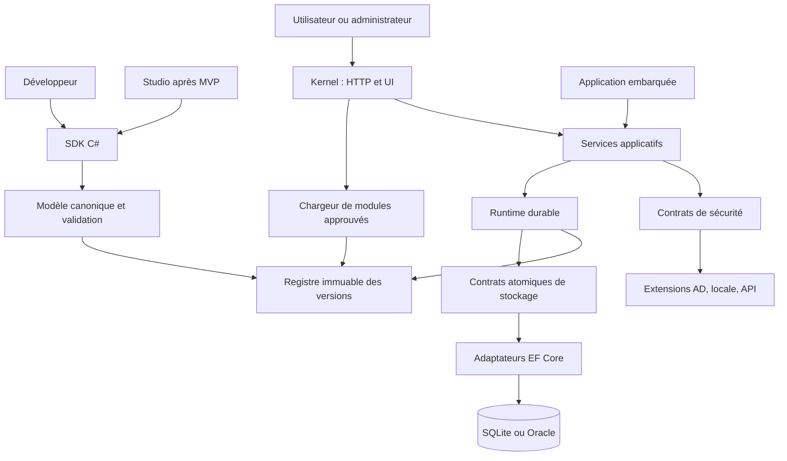

# Architecture générale

Statut : L1 à L4b implémentés localement ; les composants métier et de sécurité ultérieurs restent une proposition technique. Les stores et le worker/outbox sont éprouvés sur SQLite et Oracle Enterprise 19.19, et le binding runtime est validé avant publication.

## Responsabilités et intégration

Le Runtime est une bibliothèque sans serveur HTTP ni chargeur DLL obligatoire. Le Kernel/Host est l’exécutable qui assemble moteur, stockage, modules, identité, administration et UI. Une application embarquée réutilise ces bibliothèques et possède sa composition. Le Runtime .NET est l’environnement d’exécution de ces deux formes.

Les flèches du diagramme représentent les flux fonctionnels ; le tableau suivant fixe les références de projets. L’authentification se termine au Host ; le moteur reçoit une identité stable et le contexte d’une commande autorisée, jamais des mots de passe.

## Découpage cible

Préfixe de travail `EnterpriseWorkflow.*`, sans réservation NuGet. Les projets sont créés au moment du lot qui les justifie.

| Projet ou famille | Responsabilité | Références internes autorisées |
| --- | --- | --- |
| Abstractions | Identifiants, contrats purs des nœuds et résultats | Aucune |
| Core | Modèle canonique et validation | Abstractions |
| Sdk | Builders C# | Core, Abstractions |
| Persistence.Abstractions | Opérations atomiques et données de stockage pures | Core, Abstractions |
| Runtime.Abstractions | Contextes et résultats bornés, interfaces Service/Decision sans DI | Core, Persistence.Abstractions, Abstractions |
| Runtime | Registre global immuable, validation de binding, résolution scoped, worker configurable et dispatcher outbox | Core, Runtime.Abstractions |
| Application | Commandes, lectures et contrôles d’accès | Runtime, Security.Abstractions |
| Security.Abstractions | Identité, permissions et capacités | Abstractions |
| Security.* | Connecteurs et autorisation ; intégration sessions séparée | Security.Abstractions ; dépendances externes locales au connecteur |
| Persistence.Sqlite | Mapping EF Core intégrable, contexte dédié, SQL/conversions et migrations SQLite | Persistence.Abstractions |
| Persistence.Oracle | Mapping, SQL, conversions et migrations éprouvés sur Oracle Free et Enterprise 19.19 en L3b | Persistence.Abstractions |
| AspNetCore | HTTP, DI, sessions, worker hébergé | Application, Runtime et contrats d’intégration |
| PluginSystem | Manifestes, compatibilité, résolution des modules | Contrats purs et contrats DI dédiés |
| UI / Administration | Formulaires, pages métier et administration | Application et contrats UI/sécurité |
| Host | Racine de composition | Intégrations et adaptateurs sélectionnés |
| Cli / Templates | Scaffolding, validation et packaging | Sdk, validateur, packaging |
| Studio | Modèle visuel et export, après MVP | Sdk, Core, intégrations UI |

L’instrumentation se fait aux frontières par les abstractions .NET. Un package d’export optionnel pourra apparaître sans créer de cycle. Les contrats dépendant de `IServiceCollection`, HTTP ou Razor restent dans les intégrations correspondantes.

Les schémas possédés par les adaptateurs sont détaillés dans les dictionnaires physiques [SQLite](sqlite-schema.md) et [Oracle](oracle-schema.md). Les applications ne doivent pas traiter ces tables comme une API publique.

## Frontières

- Entrée HTTP : authentification, validation, autorisation par ressource et idempotence.
- Commande applicative : seule porte normale de mutation pour l’UI et l’API.
- Stockage : invariant atomique vérifié, même en cas de course après l’autorisation initiale.
- Exécuteur métier : code approuvé utilisant ses propres services ; pas d’accès aux tables internes via l’API du moteur.
- Extension de sécurité : reconnue explicitement au démarrage, avec capacités déclarées et échecs bornés.

L’application embarquée peut adapter ses contrôles d’accès, mais ne doit pas perdre les invariants de tâche et de concurrence. Les appels internes de bas niveau ne sont pas des endpoints publics.

## Flux de démarrage du Kernel

1. Charger la configuration et vérifier les extensions nécessaires.
2. Résoudre manifestes, compatibilité, contrats partagés et dépendances des modules.
3. Enregistrer services et endpoints protégés avant finalisation de la DI.
4. Vérifier schéma de base, versions et artefacts encore requis par les instances.
5. Valider et publier les définitions de façon immuable.
6. Activer HTTP, administration et worker ; readiness positive seulement lorsque les dépendances nécessaires sont disponibles.

Un module explicitement configuré mais incompatible doit empêcher la disponibilité plutôt que disparaître silencieusement. Ce comportement est proposé dans l’ADR 0009.

## Déploiement minimal

Un processus Host et une base ; un worker à concurrence bornée. Aucun serveur de messages, conteneur ou service JavaScript obligatoire. Une qualification multi-hôte est différée ; les tests de concurrence restent requis dès le premier worker. Le détail de l’hébergement en service Windows, service Linux ou processus macOS appartient à la documentation de distribution, pas au Core.
