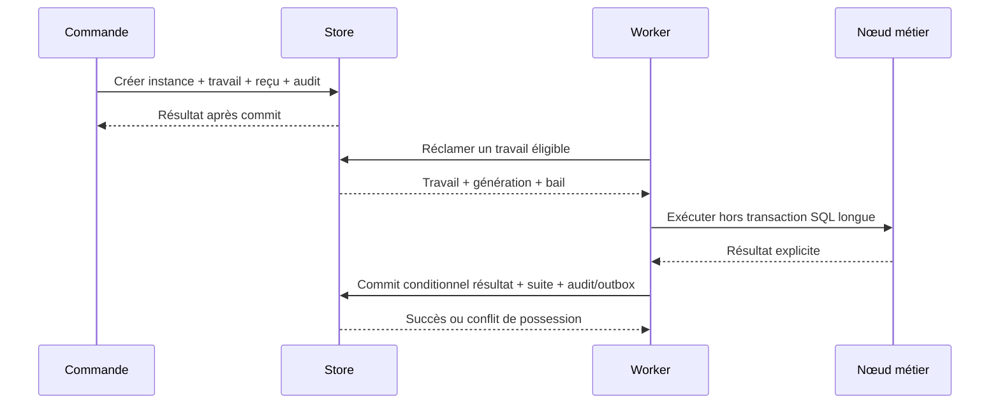

# Modèle et exécution durable

Statut : contrat de conception proposé, à approuver avant les lots L2 à L4. Aucun schéma SQL ni contrat C# public n’est figé.

## Définition canonique

Une définition porte `DefinitionId`, version immuable, version de schéma, empreinte normalisée, références des artefacts, métadonnées, nœuds et transitions. Chaque nœud possède un identifiant stable, un type enregistré avec version de contrat et une configuration sérialisable. Chaque transition explicite source, issue et destination.

Le SDK et le Studio produisent ce modèle ; le moteur ne dépend pas de leur syntaxe. DTO et JSON versionnés aux frontières ; aucune lambda, instance de service ou nom CLR arbitraire n’est un format durable. Une décision référence un évaluateur C# enregistré qui retourne une issue nommée.

MVP proposé : un point de départ, au moins une fin, graphe acyclique, parcours séquentiel et branches exclusives. Le validateur rejette doublons, références absentes, nœuds inatteignables, cycles, types inconnus et sorties ambiguës. Toute branche doit mener à une fin. Un résultat non déclaré constitue une erreur explicite, pas une transition improvisée.

## Données logiques

| Objet | Identité et contenu | Invariant |
| --- | --- | --- |
| Définition publiée | ID, version, hash, schéma, module/hash | Un contenu ne peut remplacer une version déjà publiée |
| Instance | ID, définition/version, initiateur, état JSON, statut, révision, dates | Lien immuable vers les artefacts utilisés |
| Exécution de nœud | ID d’activation, instance, nœud, état | Identité logique stable à travers les tentatives |
| Tentative | Activation, numéro, dates, erreur qualifiée | Pas de nouvelle clé métier d’effet à chaque retry |
| Travail | ID, activation, échéance, propriétaire, génération, expiration | Une seule possession valide peut committer |
| Tâche humaine | ID, activation, affectation, formulaire/version, révision, résultat | Une complétion gagnante |
| Timer | ID, activation, échéance UTC, statut | Un réveil logique unique |
| Reçu de commande | Portée, clé, empreinte de requête, résultat | Même clé + contenu différent = conflit |
| Audit | Acteur, action, ressource, corrélation, date | Mutation critique et audit validés ensemble |
| Outbox | ID d’opération, destination, contenu, livraison, tentatives | Intention persistée avec la transition |

Les événements externes ne sont pas inclus tant que leur contrat n’est pas défini. Un simple `CurrentNodeId` ne doit pas servir d’unique historique d’exécution.

## États de l’instance

| De | Vers | Déclencheur et préconditions |
| --- | --- | --- |
| Absence | Created | Démarrage autorisé, définition valide ; instance et premier travail atomiques |
| Created | Running | Premier claim valide, ou activation atomique équivalente |
| Running | Running | Transition réussie ou retry programmé ; révision et possession valides |
| Running | Waiting | Création atomique d’une tâche humaine ou d’un timer ; travail précédent clôturé |
| Waiting | Running | Complétion autorisée ou timer arrivé à échéance ; suite persistée une seule fois |
| Running | Completed | Nœud final validé ; aucun travail métier restant |
| Running | Failed | Échec permanent ou retries épuisés |
| Created, Running, Waiting | Cancelled | Commande autorisée ; invalidation des travaux et attentes dans la même transaction |

Completed, Failed et Cancelled sont terminaux au MVP. Pas de reprise manuelle de Failed sans contrat futur explicite. Un échec d’authentification, une indisponibilité SQL ou une erreur d’entrée ne fait pas automatiquement échouer l’instance.

`Cancelled` signifie que le moteur interdit la suite ; il ne prouve pas l’arrêt instantané d’un appel externe en cours. Un CancellationToken est propagé au mieux. Un ancien résultat est rejeté après invalidation, mais un effet déjà réalisé reste possible.

## États des travaux, nœuds et tâches

Travail : Ready → Leased → Done ; Leased → Ready à la reprise après expiration ou au retry programmé. Toute nouvelle possession change la génération. Un travail invalidé est Cancelled. Le renouvellement de bail est conditionnel à la génération courante et à une possession encore valide.

Nœud : Pending → Running → Succeeded, Waiting ou Failed ; Waiting → Succeeded lors de la résolution atomique ; Running → Pending lorsqu’un retry est programmé. L’historique des tentatives reste distinct. Annulation depuis un état non terminal vers Cancelled.

Tâche : Open → Completed ou Cancelled. Un état Claimed et une réaffectation sont différés pour limiter les courses du MVP ; une affectation peut désigner un groupe, dont le premier membre autorisé à committer gagne.

## Transactions et boucle du worker

Une transaction de commit vérifie statut de l’instance, révision, génération et expiration ; elle met à jour activation et instance, clôture le travail et persiste les suites, attentes et intentions de livraison. Une course perdue ne doit produire aucune écriture partielle.

L’horloge de référence des baux doit être cohérente entre claim, renouvellement et commit. Proposition : temps fourni par le store, à implémenter et tester par provider ; `TimeProvider` pour le moteur et les tests. Ne pas comparer des horloges de workers non synchronisées en prétendant garantir le fencing.

Polling SQL et `BackgroundService` sont suffisants pour démarrer. Un signal mémoire accélère éventuellement le réveil ; un redémarrage doit fonctionner sans lui. Aucun DbContext ni transaction n’est conservé durant une attente ou un appel réseau métier.

## Idempotence et effets externes

- Une activation peut être réexécutée après incident : sémantique au moins une fois.
- Une clé d’effet est stable, par exemple installation + instance + activation + nom de l’opération ; le numéro de tentative n’en fait pas partie.
- La destination doit accepter cette clé ou la duplication doit être tolérée/traitée par l’intégration.
- L’outbox rend l’intention atomique avec le moteur ; le destinataire peut recevoir plusieurs livraisons.
- Les reçus de démarrage sont scoped par installation, acteur stable et type de commande ; empreinte de la requête et résultat sont conservés. Leur rétention sera fixée avant implémentation, sans purge tant que sa sémantique n’est pas décidée.
- Pour une tâche : requête identique avec même clé rend le résultat connu après contrôle d’accès ; même clé avec autre contenu ou autre décision après clôture rend un conflit. Aucun deuxième réveil.

Un défaut transitoire autorise un retry avec délai progressif, jitter et plafond configurable. Erreur métier produit une issue prévue ; erreur permanente ou retries épuisés produisent Failed. Les valeurs par défaut sont à fixer et tester avant L4.

## Courses à résoudre

Complétion contre annulation : la transaction gagnante change la révision ; l’autre recharge et renvoie un conflit sans réveil. Timer contre annulation : même règle. Bail expiré contre ancien worker : le commit tardif échoue même si aucun effet externe ne peut être annulé. Fin d’instance contre livraison outbox : Completed décrit la fin du workflow ; une livraison encore en attente reste visible séparément et n’est pas déclarée livrée.

## Versionnement

Définition, schéma JSON, contrats de nœuds, module et packages ont des versions distinctes. Hash de graphe et hash d’artefact sont tous deux requis. Une ancienne instance ne peut se poursuivre avec du code remplacé sous le même nom. Voir [modules](extensions.md) et ADR 0009.
