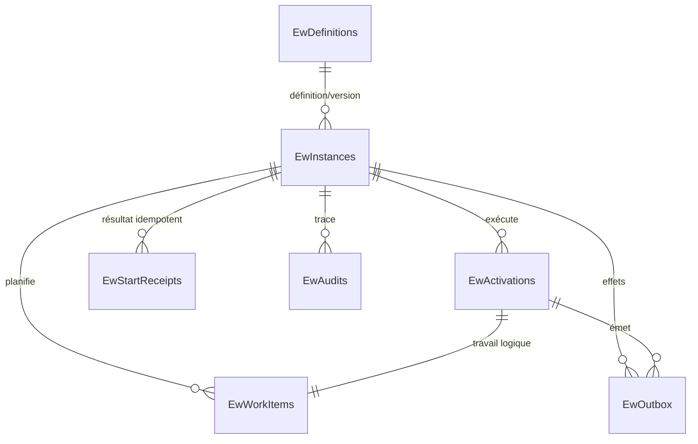

# Schéma physique SQLite du framework

Statut : schéma initial L3a complété par l’outbox L4b. Les sources exécutables sont les migrations `202610010001_InitialSqlite` et `202610030002_AddOutbox` du projet `EnterpriseWorkflow.Persistence.Sqlite`.

Cette page décrit les tables possédées par le framework, leurs relations et leur usage. Elles ne constituent pas une API SQL publique : une application doit passer par `IWorkflowStore` et exécuter les migrations fournies. Une modification directe peut contourner le fencing, l’idempotence, les révisions et l’audit.

## Vue d’ensemble

| Table | Rôle | Conservation attendue |
| --- | --- | --- |
| `EwDefinitions` | Définitions canoniques immuables publiées | Tant qu’une instance ou une politique de rétention la référence |
| `EwInstances` | État durable et révision de chaque instance | Selon la politique de rétention, encore à définir |
| `EwActivations` | Exécution logique d’un nœud et nombre de tentatives | Avec l’instance |
| `EwWorkItems` | File durable, échéance et bail fenced des workers | Avec l’instance ; aucun purgeur automatique en L3a |
| `EwStartReceipts` | Déduplication des commandes de démarrage | Sans purge automatique au MVP initial |
| `EwAudits` | Journal des mutations critiques du store | Avec l’instance dans le schéma L3a |
| `EwOutbox` | Intentions d’effets externes et état de livraison fenced | Avec l’instance ; les échecs restent visibles |
| `__EFMigrationsHistory` | Versions de schéma déjà appliquées par EF Core | Pendant toute la vie de la base |
| `sqlite_sequence` | Compteur interne SQLite utilisé par l’`AUTOINCREMENT` de `EwAudits` | Gérée exclusivement par SQLite |

Les noms `Ew*` sont stables pour la migration initiale. SQLite utilise la collation `BINARY` pour les identifiants techniques et les composantes de clés idempotentes afin de préserver leur sémantique ordinale sensible à la casse.

## `EwDefinitions`

Une ligne représente une version publiée et immuable d’une définition.

| Colonne | Type SQLite | Null | Description |
| --- | --- | --- | --- |
| `DefinitionId` | `TEXT COLLATE BINARY` | non | Identifiant technique de la définition |
| `Version` | `INTEGER` | non | Version positive de la définition |
| `Sha256` | `TEXT` | non | Empreinte SHA-256 du JSON canonique |
| `SchemaVersion` | `INTEGER` | non | Version du format de sérialisation canonique |
| `CanonicalJson` | `TEXT` | non | Graphe complet sous forme JSON canonique |
| `PublishedAtUnixMilliseconds` | `INTEGER` | non | Instant de publication fourni par l’horloge SQLite |

Clé primaire : (`DefinitionId`, `Version`). Une republication avec la même empreinte est idempotente ; une empreinte différente sous la même clé produit un conflit. La suppression est restreinte lorsqu’une instance référence la définition.

## `EwInstances`

Une ligne porte l’état courant d’une instance et sa révision de concurrence optimiste.

| Colonne | Type SQLite | Null | Description |
| --- | --- | --- | --- |
| `Id` | `TEXT` | non | `Guid` de l’instance, 32 caractères hexadécimaux |
| `DefinitionId` | `TEXT COLLATE BINARY` | non | Identifiant de la définition publiée |
| `DefinitionVersion` | `INTEGER` | non | Version exacte de la définition |
| `DefinitionSha256` | `TEXT` | non | Empreinte exacte retenue au démarrage |
| `Status` | `INTEGER` | non | État de l’instance, voir la table des codes ci-dessous |
| `Revision` | `INTEGER` | non | Révision avancée par les transitions atomiques |
| `StateSchemaVersion` | `INTEGER` | non | Version applicative de l’état métier |
| `StateJson` | `TEXT` | non | État métier complet sous forme JSON canonique |
| `BusinessKey` | `TEXT` | oui | Clé métier facultative fournie par l’appelant |
| `CorrelationId` | `TEXT` | oui | Corrélation facultative fournie par l’appelant |
| `CreatedAtUnixMilliseconds` | `INTEGER` | non | Création selon l’horloge SQLite |
| `UpdatedAtUnixMilliseconds` | `INTEGER` | non | Dernière transition d’instance |

Clé primaire : `Id`. Clé étrangère (`DefinitionId`, `DefinitionVersion`) vers `EwDefinitions`, suppression restreinte. Index : (`DefinitionId`, `DefinitionVersion`, `Status`).

| Code | État `WorkflowInstanceStatus` | Sens |
| ---: | --- | --- |
| 0 | `Created` | Transaction de démarrage validée, aucun travail encore acquis |
| 1 | `Running` | Instance en exécution |
| 2 | `Waiting` | Attente durable ; utilisée par les lots fonctionnels ultérieurs |
| 3 | `Completed` | Fin réussie |
| 4 | `Failed` | Échec permanent |
| 5 | `Cancelled` | Annulation gagnante |

## `EwActivations`

Une activation est l’exécution logique stable d’un nœud. Une reprise après expiration ou un retry conserve son `Id`, contrairement au token de bail.

| Colonne | Type SQLite | Null | Description |
| --- | --- | --- | --- |
| `Id` | `TEXT` | non | `Guid` de l’activation, 32 caractères hexadécimaux |
| `InstanceId` | `TEXT` | non | Instance propriétaire |
| `NodeId` | `TEXT COLLATE BINARY` | non | Nœud canonique exécuté |
| `Status` | `INTEGER` | non | État logique de l’activation |
| `Attempt` | `INTEGER` | non | Nombre d’acquisitions du travail, première tentative comprise |
| `ErrorCode` | `TEXT` | oui | Dernier code d’erreur durable, notamment pour retry ou échec |

Clé primaire : `Id`. Clé étrangère `InstanceId` vers `EwInstances` avec suppression en cascade. Index : `InstanceId`.

| Code | État `NodeExecutionStatus` |
| ---: | --- |
| 0 | `Pending` |
| 1 | `Running` |
| 2 | `Succeeded` |
| 3 | `Waiting` |
| 4 | `Failed` |
| 5 | `Cancelled` |

## `EwWorkItems`

Cette table est la file durable interrogée par les workers. Le bail est valide uniquement si le statut est `Leased`, si génération et token correspondent, et si `LeaseExpiresAtUnixMilliseconds` est strictement supérieur à l’heure SQLite du commit.

| Colonne | Type SQLite | Null | Description |
| --- | --- | --- | --- |
| `Id` | `TEXT` | non | `Guid` du travail, 32 caractères hexadécimaux |
| `ActivationId` | `TEXT` | non | Activation logique associée |
| `InstanceId` | `TEXT` | non | Instance propriétaire, dupliquée pour les requêtes de claim |
| `NodeId` | `TEXT COLLATE BINARY` | non | Nœud à exécuter |
| `Status` | `INTEGER` | non | État du travail |
| `DueAtUnixMilliseconds` | `INTEGER` | non | Première date UTC à laquelle le travail est réclamable |
| `OwnerId` | `TEXT COLLATE BINARY` | oui | Worker propriétaire du bail courant |
| `Generation` | `INTEGER` | non | Compteur de fencing, avancé à chaque claim ou reprise |
| `LeaseToken` | `TEXT` | oui | `Guid` aléatoire propre à la génération courante |
| `LeaseExpiresAtUnixMilliseconds` | `INTEGER` | oui | Expiration UTC calculée par le store |
| `CreatedAtUnixMilliseconds` | `INTEGER` | non | Création du travail selon l’horloge SQLite |

Clé primaire : `Id`. `ActivationId` est unique et référence `EwActivations` avec suppression en cascade. `InstanceId` référence `EwInstances` avec suppression en cascade.

Index de polling :

- (`Status`, `DueAtUnixMilliseconds`) pour les travaux prêts ;
- (`Status`, `LeaseExpiresAtUnixMilliseconds`) pour les baux expirés ;
- index unique sur `ActivationId` pour interdire deux travaux physiques concurrents pour une même activation logique.

| Code | État `WorkItemStatus` | Sens |
| ---: | --- | --- |
| 0 | `Ready` | Réclamable lorsque l’échéance est atteinte |
| 1 | `Leased` | Possédé par une génération de worker jusqu’à expiration |
| 2 | `Done` | Résultat validé |
| 3 | `Cancelled` | Invalidé par l’annulation de l’instance |

Un retry remet le même travail et la même activation à `Ready`, efface le bail et fixe une nouvelle échéance. Un commit `Continue` clôt le travail courant puis crée une nouvelle activation et un nouveau travail dans la même transaction.

## `EwStartReceipts`

Cette table garantit l’idempotence de `StartInstanceAsync` dans la portée authentifiée de la commande.

| Colonne | Type SQLite | Null | Description |
| --- | --- | --- | --- |
| `ReceiptKey` | `TEXT` | non | SHA-256 de l’encodage longueur + UTF-8 de la portée et de la clé ; clé primaire physique |
| `InstallationId` | `TEXT COLLATE BINARY` | non | Installation propriétaire de la commande |
| `CommandTypeId` | `TEXT COLLATE BINARY` | non | Type durable de commande |
| `ActorProviderId` | `TEXT COLLATE BINARY` | non | Fournisseur d’identité |
| `ActorSubjectId` | `TEXT COLLATE BINARY` | non | Sujet stable chez ce fournisseur |
| `IdempotencyKey` | `TEXT COLLATE BINARY` | non | Clé fournie par l’appelant |
| `RequestSha256` | `TEXT` | non | Empreinte du contenu logique de la requête |
| `InstanceId` | `TEXT` | non | Instance créée par la première commande validée |
| `InstanceRevision` | `INTEGER` | non | Révision retournée lors du démarrage initial |
| `CommittedAtUnixMilliseconds` | `INTEGER` | non | Instant du commit initial |

Clé primaire : `ReceiptKey`. Les composantes originales (`InstallationId`, `CommandTypeId`, `ActorProviderId`, `ActorSubjectId`, `IdempotencyKey`) restent stockées et sont revérifiées après lecture afin de détecter une corruption ou une collision théorique. `InstanceId` référence `EwInstances` avec suppression restreinte. Une répétition avec la même empreinte de requête retourne le résultat enregistré ; une autre empreinte produit un conflit.

## `EwAudits`

Le journal L3a enregistre les mutations critiques dans la même transaction que l’état concerné.

| Colonne | Type SQLite | Null | Description |
| --- | --- | --- | --- |
| `Sequence` | `INTEGER AUTOINCREMENT` | non | Ordre local monotone et clé primaire |
| `InstanceId` | `TEXT` | non | Instance concernée |
| `EventType` | `TEXT` | non | `InstanceStarted`, `InstanceRunning`, `NodeCommitted` ou `InstanceCancelled` en L3a |
| `Revision` | `INTEGER` | non | Révision d’instance associée à l’événement |
| `OccurredAtUnixMilliseconds` | `INTEGER` | non | Instant fourni par l’horloge SQLite |
| `ActorProviderId` | `TEXT COLLATE BINARY` | oui | Fournisseur de l’acteur lorsqu’il existe |
| `ActorSubjectId` | `TEXT COLLATE BINARY` | oui | Sujet de l’acteur lorsqu’il existe |

Clé étrangère `InstanceId` vers `EwInstances` avec suppression en cascade. Index : (`InstanceId`, `Sequence`). Ce journal fournit une trace fonctionnelle transactionnelle ; L3a ne revendique pas un journal cryptographiquement inviolable ni une conservation indépendante après suppression d’une instance.

## `EwOutbox`

Chaque ligne est une intention externe créée dans la même transaction que le succès du nœud. Sa livraison possède un bail et un fencing indépendants du worker métier.

| Colonne | Type SQLite | Null | Description |
| --- | --- | --- | --- |
| `Id` | `TEXT` | non | `Guid` du message, clé primaire |
| `InstanceId` | `TEXT` | non | Instance ayant produit l’intention |
| `ActivationId` | `TEXT` | non | Activation logique stable |
| `OperationId` | `TEXT COLLATE BINARY` | non | Nom d’opération unique dans l’activation |
| `Destination` | `TEXT COLLATE BINARY` | non | Destination logique résolue par le transport |
| `ContentType` | `TEXT` | non | Type du contenu |
| `PayloadJson` | `TEXT` | non | Payload JSON canonique |
| `IdempotencyKey` | `TEXT` | non | SHA-256 stable de l’instance, activation et opération |
| `Status` | `INTEGER` | non | `0 Ready`, `1 Leased`, `2 Delivered`, `3 Failed` |
| `Attempt` | `INTEGER` | non | Nombre de claims de livraison |
| `DueAtUnixMilliseconds` | `INTEGER` | non | Prochaine échéance de livraison |
| `OwnerId` | `TEXT COLLATE BINARY` | oui | Dispatcher propriétaire |
| `Generation` | `INTEGER` | non | Génération de fencing |
| `LeaseToken` | `TEXT` | oui | Token de la génération courante |
| `LeaseExpiresAtUnixMilliseconds` | `INTEGER` | oui | Expiration selon l’horloge SQLite |
| `LastErrorCode` | `TEXT` | oui | Dernière erreur de transport ou cause de dead letter |
| `CreatedAtUnixMilliseconds` | `INTEGER` | non | Création atomique avec le commit du nœud |
| `DeliveredAtUnixMilliseconds` | `INTEGER` | oui | Acquittement réussi |

Contrainte unique (`ActivationId`, `OperationId`). Index de polling (`Status`, `DueAtUnixMilliseconds`). Les clés étrangères vers instance et activation sont en cascade. `Failed` est terminal pour le dispatcher automatique mais ne change pas l’état métier de l’instance ; un rejeu administratif futur devra être explicite et audité.

## `__EFMigrationsHistory`

EF Core crée et maintient cette table technique lors de `SqliteWorkflowDatabase.MigrateAsync`. Elle contient l’identifiant de migration et la version EF utilisée. La migration L3a enregistrée est `202610010001_InitialSqlite`.

| Colonne | Type SQLite | Null | Description |
| --- | --- | --- | --- |
| `MigrationId` | `TEXT` | non | Identifiant unique et ordonné de la migration appliquée |
| `ProductVersion` | `TEXT` | non | Version EF Core ayant produit la migration |

Le store n’appelle jamais les migrations automatiquement. La racine de composition doit les appliquer avant de déclarer le service prêt. Les migrations enregistrées sont `202610010001_InitialSqlite` et `202610030002_AddOutbox`. Cette table ne doit pas être éditée ou supprimée manuellement.

## Table interne `sqlite_sequence`

SQLite crée cette table système parce que `EwAudits.Sequence` utilise `AUTOINCREMENT`. Elle conserve le dernier compteur alloué, notamment pour `EwAudits`, et ne fait pas partie du modèle EF ou du contrat du store. Ni l’application ni une procédure d’exploitation ne doivent la modifier directement.

## Transactions et tables touchées

| Opération du store | Lectures principales | Écritures atomiques |
| --- | --- | --- |
| `PublishDefinitionAsync` | `EwDefinitions` | `EwDefinitions` |
| `StartInstanceAsync` | `EwStartReceipts`, `EwDefinitions` | `EwInstances`, `EwActivations`, `EwWorkItems`, `EwStartReceipts`, `EwAudits` |
| `ClaimDueWorkAsync` | `EwWorkItems`, `EwInstances`, `EwActivations`, `EwDefinitions` | bail/génération dans `EwWorkItems`, tentative dans `EwActivations`, éventuellement statut/révision et audit ; retourne le snapshot d’exécution cohérent |
| `RenewLeaseAsync` | `EwWorkItems`, `EwInstances` | expiration dans `EwWorkItems` |
| `CommitNodeResultAsync` | `EwWorkItems`, `EwInstances`, `EwActivations` | état, révision, activation, travail courant, suite éventuelle, `EwOutbox` et `EwAudits` |
| `CancelInstanceAsync` | `EwInstances`, travaux et activations actifs | instance annulée, invalidation des travaux/activations et `EwAudits` |
| `ClaimDueOutboxAsync` | `EwOutbox` | bail, génération et tentative de livraison |
| `CommitOutboxAsync` | `EwOutbox` | acquittement, retry planifié ou passage durable en `Failed` |

Toutes ces mutations utilisent une transaction d’écriture SQLite courte. Une condition de bail, de statut ou de révision non satisfaite provoque un rollback sans écriture partielle.

## Évolutions prévues

Le schéma L4b ne contient pas encore les tables de tâches humaines ou timers : elles seront ajoutées par les migrations de L6. Oracle possède son [propre schéma physique](oracle-schema.md) et ses propres migrations ; cette page ne doit pas être utilisée comme promesse de noms ou de types Oracle.
